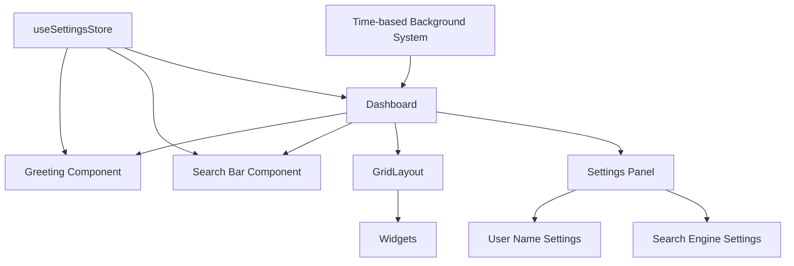

# ApexGrid Enhancements Design Document

## Overview

This design document outlines the technical approach for implementing three major enhancements to the ApexGrid Chrome extension:

1. **Fix Widget Resize Persistence Bug** - Ensure layout changes persist correctly across page refreshes
2. **Add Greeting and Search Functionality** - Implement personalized greeting with integrated web search
3. **Enhance Visual Design** - Modernize the UI with glassmorphism, gradients, and smooth animations

### Technology Stack

- **Framework**: React 19 + TypeScript (existing)
- **State Management**: Zustand (existing)
- **Storage**: Chrome Storage API (existing)
- **Styling**: Tailwind CSS with custom animations
- **Search Integration**: Direct URL construction for search engines

## Architecture

### Component Hierarchy



## Components and Interfaces

### 1. Fix Widget Resize Persistence

#### Problem Analysis

The current implementation uses debouncing in `GridLayout.tsx` which delays storage writes by 500ms. If a user refreshes the page during this debounce period, the resize changes are lost.

#### Solution Design

**Approach**: Implement immediate persistence for resize operations while maintaining debouncing for drag operations.

```typescript
// components/GridLayout.tsx - Enhanced version

interface GridLayoutProps {
    children: React.ReactNode;
}

export const GridLayout: React.FC<GridLayoutProps> = ({ children }) => {
    const { layout, updateLayout } = useLayoutStore();
    const lastLayoutRef = useRef<Layout>(layout);
    const isResizingRef = useRef(false);

    // Immediate update for resize operations
    const handleResizeStop = useCallback((newLayout: RGLLayout[]) => {
        isResizingRef.current = false;
        const updatedLayout: Layout = convertLayout(newLayout);
        
        // Immediate persistence for resize
        updateLayout(updatedLayout).catch(error => {
            console.error('Failed to persist resize:', error);
        });
    }, [updateLayout]);

    // Debounced update for drag operations
    const debouncedUpdateLayout = useRef(
        debounce((updatedLayout: Layout) => {
            if (!isResizingRef.current) {
                updateLayout(updatedLayout);
            }
        }, 500)
    ).current;

    const handleLayoutChange = useCallback((newLayout: RGLLayout[]) => {
        const updatedLayout: Layout = convertLayout(newLayout);
        
        // Use debounced update for drag operations
        if (!isResizingRef.current) {
            debouncedUpdateLayout(updatedLayout);
        }
    }, [debouncedUpdateLayout]);

    const handleResizeStart = useCallback(() => {
        isResizingRef.current = true;
    }, []);

    return (
        <ReactGridLayout
            layout={layout}
            onLayoutChange={handleLayoutChange}
            onResizeStart={handleResizeStart}
            onResizeStop={handleResizeStop}
            // ... other props
        >
            {children}
        </ReactGridLayout>
    );
};
```

#### Storage Retry Logic

Enhance the storage service with retry logic:

```typescript
// services/storage.ts - Enhanced version

export const storage = {
    async set(key: string, value: any, retries = 3): Promise<void> {
        for (let attempt = 0; attempt < retries; attempt++) {
            try {
                await chrome.storage.sync.set({ [key]: value });
                return;
            } catch (error) {
                if (attempt === retries - 1) throw error;
                
                // Exponential backoff: 100ms, 200ms, 400ms
                await new Promise(resolve => 
                    setTimeout(resolve, Math.pow(2, attempt) * 100)
                );
            }
        }
    },
    // ... other methods
};
```

### 2. Greeting and Search Components

#### Greeting Component

```typescript
// components/Greeting.tsx

interface GreetingProps {
    className?: string;
}

export const Greeting: React.FC<GreetingProps> = ({ className }) => {
    const { userName } = useSettingsStore();
    const [greeting, setGreeting] = useState('');

    useEffect(() => {
        const updateGreeting = () => {
            const hour = new Date().getHours();
            
            if (hour >= 5 && hour < 12) {
                setGreeting('Good morning');
            } else if (hour >= 12 && hour < 17) {
                setGreeting('Good afternoon');
            } else if (hour >= 17 && hour < 21) {
                setGreeting('Good evening');
            } else {
                setGreeting('Good night');
            }
        };

        updateGreeting();
        
        // Update greeting every minute
        const interval = setInterval(updateGreeting, 60000);
        return () => clearInterval(interval);
    }, []);

    return (
        <div className={cn('text-center', className)}>
            <h1 className="text-5xl font-bold mb-2 text-foreground">
                {greeting}{userName ? `, ${userName}` : ''}
            </h1>
        </div>
    );
};
```

#### Search Bar Component

```typescript
// components/SearchBar.tsx

interface SearchEngine {
    name: string;
    icon: string;
    searchUrl: (query: string) => string;
}

const SEARCH_ENGINES: Record<string, SearchEngine> = {
    google: {
        name: 'Google',
        icon: '🔍',
        searchUrl: (q) => `https://www.google.com/search?q=${encodeURIComponent(q)}`
    },
    bing: {
        name: 'Bing',
        icon: '🅱️',
        searchUrl: (q) => `https://www.bing.com/search?q=${encodeURIComponent(q)}`
    },
    duckduckgo: {
        name: 'DuckDuckGo',
        icon: '🦆',
        searchUrl: (q) => `https://duckduckgo.com/?q=${encodeURIComponent(q)}`
    },
    yahoo: {
        name: 'Yahoo',
        icon: 'Y!',
        searchUrl: (q) => `https://search.yahoo.com/search?p=${encodeURIComponent(q)}`
    }
};

interface SearchBarProps {
    className?: string;
}

export const SearchBar: React.FC<SearchBarProps> = ({ className }) => {
    const { searchEngine } = useSettingsStore();
    const [query, setQuery] = useState('');
    const inputRef = useRef<HTMLInputElement>(null);

    const handleSearch = (e: React.FormEvent) => {
        e.preventDefault();
        
        if (!query.trim()) return;
        
        const engine = SEARCH_ENGINES[searchEngine] || SEARCH_ENGINES.google;
        const searchUrl = engine.searchUrl(query);
        
        window.location.href = searchUrl;
    };

    return (
        <form 
            onSubmit={handleSearch}
            className={cn('w-full max-w-2xl mx-auto', className)}
        >
            <div className="relative">
                <input
                    ref={inputRef}
                    type="text"
                    value={query}
                    onChange={(e) => setQuery(e.target.value)}
                    placeholder={`Search with ${SEARCH_ENGINES[searchEngine]?.name || 'Google'}...`}
                    className="w-full px-6 py-4 text-lg rounded-full bg-card/80 backdrop-blur-md border border-border/50 focus:border-primary focus:outline-none focus:ring-2 focus:ring-primary/20 transition-all"
                    aria-label="Search the web"
                />
                <button
                    type="submit"
                    className="absolute right-2 top-1/2 -translate-y-1/2 px-6 py-2 bg-primary text-primary-foreground rounded-full hover:bg-primary/90 transition-colors"
                    aria-label="Submit search"
                >
                    {SEARCH_ENGINES[searchEngine]?.icon || '🔍'}
                </button>
            </div>
        </form>
    );
};
```

#### Settings Store Enhancement

```typescript
// stores/useSettingsStore.ts - Enhanced version

interface SettingsStore {
    theme: 'dark' | 'light';
    background: string | null;
    userName: string | null;
    searchEngine: 'google' | 'bing' | 'duckduckgo' | 'yahoo';
    isInitialized: boolean;
    
    setTheme: (theme: 'dark' | 'light') => Promise<void>;
    setBackground: (background: string | null) => Promise<void>;
    setUserName: (name: string | null) => Promise<void>;
    setSearchEngine: (engine: string) => Promise<void>;
    initializeSettings: () => Promise<void>;
}

const DEFAULT_SETTINGS: AppSettings = {
    theme: 'dark',
    background: null,
    userName: null,
    searchEngine: 'google',
};

// Add new actions
setUserName: async (userName: string | null) => {
    try {
        // Validate name
        if (userName && userName.length > 50) {
            throw new Error('Name must be 50 characters or less');
        }
        
        if (userName && !/^[a-zA-Z0-9\s]*$/.test(userName)) {
            throw new Error('Name can only contain letters, numbers, and spaces');
        }
        
        set({ userName });
        
        const settings = { ...get(), userName };
        await storage.set('settings', settings);
    } catch (error) {
        console.error('Failed to update user name:', error);
        throw error;
    }
},

setSearchEngine: async (searchEngine: string) => {
    try {
        set({ searchEngine });
        
        const settings = { ...get(), searchEngine };
        await storage.set('settings', settings);
    } catch (error) {
        console.error('Failed to update search engine:', error);
        throw error;
    }
},
```

### 3. Enhanced Visual Design

#### Time-based Background Gradients

```typescript
// lib/timeBasedGradients.ts

export interface TimeGradient {
    from: string;
    via?: string;
    to: string;
    period: string;
}

export const TIME_GRADIENTS: Record<string, TimeGradient> = {
    morning: {
        from: '#FFE5B4', // Peach
        via: '#FFB6C1',  // Light pink
        to: '#87CEEB',   // Sky blue
        period: 'morning'
    },
    afternoon: {
        from: '#87CEEB', // Sky blue
        via: '#4FC3F7',  // Light blue
        to: '#29B6F6',   // Bright blue
        period: 'afternoon'
    },
    evening: {
        from: '#FF6B6B', // Coral
        via: '#FF8E53',  // Orange
        to: '#FE6B8B',   // Pink
        period: 'evening'
    },
    night: {
        from: '#1A1A2E', // Dark blue
        via: '#16213E',  // Navy
        to: '#0F3460',   // Deep blue
        period: 'night'
    }
};

export function getCurrentTimeGradient(): TimeGradient {
    const hour = new Date().getHours();
    
    if (hour >= 5 && hour < 12) return TIME_GRADIENTS.morning;
    if (hour >= 12 && hour < 17) return TIME_GRADIENTS.afternoon;
    if (hour >= 17 && hour < 21) return TIME_GRADIENTS.evening;
    return TIME_GRADIENTS.night;
}

export function getGradientStyle(gradient: TimeGradient): React.CSSProperties {
    return {
        background: gradient.via
            ? `linear-gradient(135deg, ${gradient.from} 0%, ${gradient.via} 50%, ${gradient.to} 100%)`
            : `linear-gradient(135deg, ${gradient.from} 0%, ${gradient.to} 100%)`,
        transition: 'background 1s ease-in-out'
    };
}
```

#### Glassmorphism Widget Styling

```css
/* index.css - Enhanced widget styles */

@layer components {
    .widget-glass {
        background: rgba(255, 255, 255, 0.1);
        backdrop-filter: blur(10px);
        -webkit-backdrop-filter: blur(10px);
        border: 1px solid rgba(255, 255, 255, 0.2);
        box-shadow: 0 8px 32px 0 rgba(0, 0, 0, 0.1);
    }
    
    .dark .widget-glass {
        background: rgba(0, 0, 0, 0.3);
        border: 1px solid rgba(255, 255, 255, 0.1);
        box-shadow: 0 8px 32px 0 rgba(0, 0, 0, 0.3);
    }
    
    .widget-glass-hover {
        transition: all 0.3s ease;
    }
    
    .widget-glass-hover:hover {
        border-color: rgba(59, 130, 246, 0.5);
        box-shadow: 0 8px 32px 0 rgba(59, 130, 246, 0.2);
        transform: translateY(-2px);
    }
    
    .widget-gradient-border {
        position: relative;
        border: 2px solid transparent;
        background-clip: padding-box;
    }
    
    .widget-gradient-border::before {
        content: '';
        position: absolute;
        inset: 0;
        border-radius: inherit;
        padding: 2px;
        background: linear-gradient(135deg, 
            rgba(59, 130, 246, 0.5) 0%, 
            rgba(147, 51, 234, 0.5) 100%);
        -webkit-mask: 
            linear-gradient(#fff 0 0) content-box, 
            linear-gradient(#fff 0 0);
        -webkit-mask-composite: xor;
        mask-composite: exclude;
        pointer-events: none;
    }
}
```

#### Enhanced Widget Wrapper

```typescript
// components/WidgetWrapper.tsx - Enhanced version

interface WidgetWrapperProps {
    id: string;
    title: string;
    onRemove: () => void;
    children: React.ReactNode;
}

export const WidgetWrapper: React.FC<WidgetWrapperProps> = ({
    id,
    title,
    onRemove,
    children
}) => {
    return (
        <Card className="h-full widget-glass widget-glass-hover widget-gradient-border animate-in fade-in duration-300">
            <CardHeader className="widget-drag-handle flex flex-row items-center justify-between space-y-0 pb-2">
                <CardTitle className="text-sm font-medium">
                    {title}
                </CardTitle>
                <button
                    onClick={onRemove}
                    className="h-6 w-6 rounded-full hover:bg-destructive/10 hover:text-destructive transition-colors"
                    aria-label={`Remove ${title} widget`}
                >
                    <X className="h-4 w-4" />
                </button>
            </CardHeader>
            <CardContent>
                {children}
            </CardContent>
        </Card>
    );
};
```

#### Dashboard Layout Enhancement

```typescript
// components/Dashboard.tsx - Enhanced version

export const Dashboard: React.FC = () => {
    const [timeGradient, setTimeGradient] = useState(getCurrentTimeGradient());
    const { background } = useSettingsStore();
    
    // Update gradient every minute
    useEffect(() => {
        const interval = setInterval(() => {
            setTimeGradient(getCurrentTimeGradient());
        }, 60000);
        
        return () => clearInterval(interval);
    }, []);
    
    const backgroundStyle = useMemo(() => {
        if (background) {
            return background.startsWith('#') || background.startsWith('rgb')
                ? { backgroundColor: background }
                : { backgroundImage: `url(${background})`, backgroundSize: 'cover' };
        }
        
        return getGradientStyle(timeGradient);
    }, [background, timeGradient]);
    
    return (
        <div
            className="min-h-screen p-4 transition-all duration-1000"
            style={backgroundStyle}
        >
            <div className="max-w-7xl mx-auto">
                <Greeting className="mb-6 animate-in fade-in slide-in-from-top duration-500" />
                <SearchBar className="mb-8 animate-in fade-in slide-in-from-top duration-500 delay-100" />
                
                <GridLayout>
                    {/* Widgets */}
                </GridLayout>
            </div>
        </div>
    );
};
```

## Data Models

### Enhanced Settings Schema

```typescript
// types/storage.ts - Enhanced version

export interface AppSettings {
    theme: 'dark' | 'light';
    background: string | null;
    userName: string | null;
    searchEngine: 'google' | 'bing' | 'duckduckgo' | 'yahoo';
}

export interface StorageSchema {
    layout: Layout;
    widgets: Widget[];
    widgetData: WidgetData;
    settings: AppSettings;
}
```

## Error Handling

### Storage Persistence Errors

```typescript
// Enhanced error handling for storage operations

async function persistLayoutWithRetry(layout: Layout): Promise<void> {
    const maxRetries = 3;
    
    for (let attempt = 0; attempt < maxRetries; attempt++) {
        try {
            await storage.set('layout', layout);
            return;
        } catch (error) {
            if (attempt === maxRetries - 1) {
                // Show user notification
                console.error('Failed to save layout after 3 attempts:', error);
                
                // Optionally show toast notification
                showNotification({
                    type: 'error',
                    message: 'Failed to save layout changes. Please try again.'
                });
                
                throw error;
            }
            
            // Exponential backoff
            await new Promise(resolve => 
                setTimeout(resolve, Math.pow(2, attempt) * 100)
            );
        }
    }
}
```

### Search Input Validation

```typescript
// Validate and sanitize search queries

function sanitizeSearchQuery(query: string): string {
    // Remove leading/trailing whitespace
    const trimmed = query.trim();
    
    // Limit length to prevent URL issues
    const maxLength = 2000;
    return trimmed.slice(0, maxLength);
}
```

## Performance Optimization

### 1. Debouncing Strategy

- **Drag operations**: 500ms debounce (existing)
- **Resize operations**: Immediate persistence (new)
- **Gradient transitions**: 1000ms smooth transition

### 2. Component Memoization

```typescript
// Memoize expensive components
export const Greeting = React.memo(GreetingComponent);
export const SearchBar = React.memo(SearchBarComponent);
```

### 3. Lazy Loading

```typescript
// Lazy load settings panel
const SettingsPanel = React.lazy(() => import('./SettingsPanel'));
```

## Accessibility

### 1. Keyboard Navigation

- Search bar: Auto-focus on `/` key press
- Widgets: Tab navigation maintained
- Settings: Escape key to close

### 2. Screen Reader Support

```typescript
// ARIA labels for new components
<input
    aria-label="Search the web"
    aria-describedby="search-engine-info"
/>

<div id="search-engine-info" className="sr-only">
    Currently using {searchEngine} search engine
</div>
```

### 3. Reduced Motion

```css
@media (prefers-reduced-motion: reduce) {
    .widget-glass-hover:hover {
        transform: none;
    }
    
    .animate-in {
        animation: none;
    }
}
```

## Testing Strategy

### Unit Tests

1. **Greeting Component**
   - Test time-based greeting logic
   - Test name display/hide logic
   - Test greeting updates

2. **Search Bar Component**
   - Test search submission
   - Test empty query handling
   - Test URL construction for each engine

3. **Storage Retry Logic**
   - Test successful persistence
   - Test retry mechanism
   - Test failure after max retries

### Integration Tests

1. **Layout Persistence**
   - Test resize persistence
   - Test drag persistence
   - Test refresh behavior

2. **Settings Persistence**
   - Test user name save/load
   - Test search engine save/load

### E2E Tests

1. **Complete User Flow**
   - Resize widget → refresh → verify persistence
   - Set name → refresh → verify greeting
   - Search → verify correct engine used

## Browser Extension Configuration

No changes required to `manifest.json` - all enhancements use existing permissions.

## Migration Strategy

### Existing Users

```typescript
// Migrate existing settings to new schema
async function migrateSettings(oldSettings: any): Promise<AppSettings> {
    return {
        theme: oldSettings.theme || 'dark',
        background: oldSettings.background || null,
        userName: null, // New field
        searchEngine: 'google', // New field with default
    };
}
```

## Future Enhancements

1. **Custom search engines** - Allow users to add custom search providers
2. **Voice search** - Integrate Web Speech API
3. **Search suggestions** - Show autocomplete suggestions
4. **Multiple greeting styles** - Let users choose greeting format
5. **Background image library** - Curated time-based backgrounds
6. **Widget themes** - Per-widget color customization

## Security Considerations

1. **Search Query Sanitization**: Prevent XSS through URL manipulation
2. **User Name Validation**: Restrict to alphanumeric + spaces
3. **Storage Quota**: Monitor storage usage for large names/settings
4. **URL Construction**: Use proper encoding for search queries
