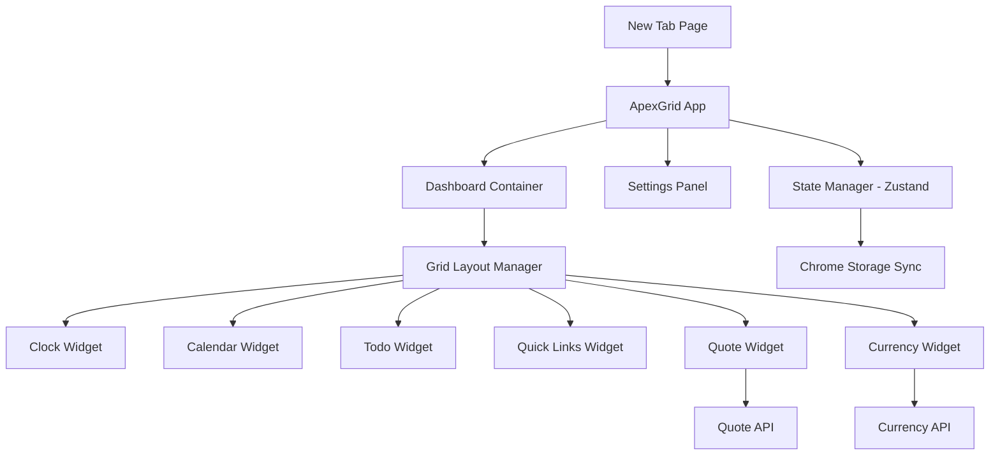

# ApexGrid Design Document

## Overview

ApexGrid is a Chrome browser extension built with React, TypeScript, and Vite that replaces the default new tab page with a customizable widget-based dashboard. The architecture follows a component-based design with clear separation between UI, state management, storage, and external API integrations.

### Technology Stack

- **Framework**: React 19 + TypeScript
- **Build Tool**: Vite (optimized for browser extensions)
- **UI Library**: shadcn/ui + Tailwind CSS
- **Grid System**: react-grid-layout
- **State Management**: Zustand
- **Storage**: Chrome Storage API (sync)
- **APIs**: Quotable.io (quotes), ExchangeRate-API (currency)

## Architecture

### High-Level Architecture



### Directory Structure

```
apexgrid/
├── public/
│   ├── manifest.json          # Extension manifest
│   └── icons/                 # Extension icons
├── src/
│   ├── components/
│   │   ├── ui/               # shadcn/ui components
│   │   ├── widgets/          # Widget implementations
│   │   │   ├── ClockWidget.tsx
│   │   │   ├── CalendarWidget.tsx
│   │   │   ├── TodoWidget.tsx
│   │   │   ├── QuickLinksWidget.tsx
│   │   │   ├── QuoteWidget.tsx
│   │   │   └── CurrencyWidget.tsx
│   │   ├── Dashboard.tsx     # Main dashboard container
│   │   ├── GridLayout.tsx    # Grid layout wrapper
│   │   └── SettingsPanel.tsx # Settings UI
│   ├── stores/
│   │   ├── useLayoutStore.ts # Layout state (positions, sizes)
│   │   ├── useWidgetStore.ts # Widget data state
│   │   └── useSettingsStore.ts # App settings state
│   ├── services/
│   │   ├── storage.ts        # Chrome storage abstraction
│   │   ├── quoteApi.ts       # Quote API client
│   │   └── currencyApi.ts    # Currency API client
│   ├── types/
│   │   ├── widget.ts         # Widget type definitions
│   │   └── layout.ts         # Layout type definitions
│   ├── lib/
│   │   └── utils.ts          # Utility functions
│   ├── App.tsx               # Root component
│   └── main.tsx              # Entry point
├── tailwind.config.js
├── vite.config.ts
└── package.json
```

## Components and Interfaces

### Core Types

```typescript
// types/widget.ts
export type WidgetType = 'clock' | 'calendar' | 'todo' | 'quicklinks' | 'quote' | 'currency';

export interface Widget {
  id: string;
  type: WidgetType;
  enabled: boolean;
}

export interface WidgetData {
  [widgetId: string]: any; // Widget-specific data
}

// types/layout.ts
export interface LayoutItem {
  i: string;           // Widget ID
  x: number;           // Grid X position
  y: number;           // Grid Y position
  w: number;           // Width in grid units
  h: number;           // Height in grid units
  minW?: number;       // Minimum width
  minH?: number;       // Minimum height
  maxW?: number;       // Maximum width
  maxH?: number;       // Maximum height
}

export type Layout = LayoutItem[];
```

### State Management (Zustand)

```typescript
// stores/useLayoutStore.ts
interface LayoutStore {
  layout: Layout;
  setLayout: (layout: Layout) => void;
  updateLayout: (layout: Layout) => Promise<void>;
}

// stores/useWidgetStore.ts
interface WidgetStore {
  widgets: Widget[];
  widgetData: WidgetData;
  addWidget: (type: WidgetType) => void;
  removeWidget: (id: string) => void;
  updateWidgetData: (id: string, data: any) => Promise<void>;
}

// stores/useSettingsStore.ts
interface SettingsStore {
  theme: 'dark' | 'light';
  background: string | null;
  setTheme: (theme: 'dark' | 'light') => void;
  setBackground: (background: string | null) => void;
}
```

### Widget Component Interface

All widgets follow a consistent interface:

```typescript
interface WidgetProps {
  id: string;
  data?: any;
  onDataChange?: (data: any) => void;
}

// Example: ClockWidget
export const ClockWidget: React.FC<WidgetProps> = ({ id }) => {
  // Widget implementation
};
```

### Dashboard Component

The Dashboard orchestrates the grid layout and widget rendering:

```typescript
// components/Dashboard.tsx
export const Dashboard: React.FC = () => {
  const { layout, updateLayout } = useLayoutStore();
  const { widgets } = useWidgetStore();
  
  const handleLayoutChange = (newLayout: Layout) => {
    updateLayout(newLayout);
  };
  
  return (
    <GridLayout
      layout={layout}
      onLayoutChange={handleLayoutChange}
    >
      {widgets.map(widget => (
        <WidgetRenderer key={widget.id} widget={widget} />
      ))}
    </GridLayout>
  );
};
```

### Grid Layout Wrapper

Wraps react-grid-layout with ApexGrid-specific configuration:

```typescript
// components/GridLayout.tsx
export const GridLayout: React.FC<GridLayoutProps> = ({
  layout,
  onLayoutChange,
  children
}) => {
  return (
    <ReactGridLayout
      className="layout"
      layout={layout}
      cols={12}
      rowHeight={80}
      width={1200}
      onLayoutChange={onLayoutChange}
      draggableHandle=".widget-drag-handle"
      resizeHandles={['se']}
    >
      {children}
    </ReactGridLayout>
  );
};
```

## Data Models

### Storage Schema

Data persisted in Chrome Storage API:

```typescript
interface StorageSchema {
  // Layout configuration
  layout: Layout;
  
  // Widget configurations
  widgets: Widget[];
  
  // Widget-specific data
  widgetData: {
    [widgetId: string]: {
      // Todo widget
      todos?: Array<{
        id: string;
        text: string;
        completed: boolean;
        createdAt: number;
      }>;
      
      // Quick links widget
      links?: Array<{
        id: string;
        title: string;
        url: string;
      }>;
      
      // Quote widget cache
      quote?: {
        text: string;
        author: string;
        cachedAt: number;
      };
      
      // Currency widget cache
      currency?: {
        rates: Record<string, number>;
        lastUpdate: number;
      };
    };
  };
  
  // App settings
  settings: {
    theme: 'dark' | 'light';
    background: string | null;
  };
}
```

### Default Layout

Initial widget layout for new users:

```typescript
const DEFAULT_LAYOUT: Layout = [
  { i: 'clock-1', x: 0, y: 0, w: 3, h: 2, minW: 2, minH: 2 },
  { i: 'calendar-1', x: 3, y: 0, w: 3, h: 2, minW: 2, minH: 2 },
  { i: 'todo-1', x: 6, y: 0, w: 3, h: 2, minW: 2, minH: 2 },
  { i: 'quicklinks-1', x: 9, y: 0, w: 3, h: 2, minW: 2, minH: 2 },
  { i: 'quote-1', x: 0, y: 2, w: 6, h: 1, minW: 3, minH: 1 },
  { i: 'currency-1', x: 6, y: 2, w: 6, h: 1, minW: 3, minH: 1 },
];
```

## Widget Implementations

### Clock Widget

- Displays current time and date
- Updates every 60 seconds using setInterval
- Supports digital format (analog as future enhancement)
- Uses Intl.DateTimeFormat for localization

### Calendar Widget

- Renders monthly calendar grid
- Highlights current date
- Navigation buttons for previous/next month
- Uses date-fns for date calculations

### Todo Widget

- Input field for new tasks
- Checkbox for completion toggle
- Delete button for each task
- Persists to Chrome Storage on every change

### Quick Links Widget

- Add/edit/delete link functionality
- Dialog for link input (title + URL)
- Grid or list display of links
- Opens links in current tab on click

### Quote Widget

- Fetches from Quotable.io API
- Caches quote for 24 hours
- Displays quote text and author
- Fallback to local quote on API failure

### Currency Widget

- Fetches from ExchangeRate-API
- Displays USD, THB, LAK rates
- Updates every 60 minutes
- Shows last update timestamp
- Caches rates for offline access

## External API Integration

### Quote API (Quotable.io)

```typescript
// services/quoteApi.ts
export interface Quote {
  text: string;
  author: string;
}

export async function fetchQuote(): Promise<Quote> {
  const response = await fetch('https://api.quotable.io/random');
  const data = await response.json();
  return {
    text: data.content,
    author: data.author
  };
}
```

### Currency API (ExchangeRate-API)

```typescript
// services/currencyApi.ts
export interface ExchangeRates {
  rates: Record<string, number>;
  lastUpdate: number;
}

export async function fetchExchangeRates(): Promise<ExchangeRates> {
  const response = await fetch(
    'https://api.exchangerate-api.com/v4/latest/USD'
  );
  const data = await response.json();
  return {
    rates: {
      USD: 1,
      THB: data.rates.THB,
      LAK: data.rates.LAK
    },
    lastUpdate: Date.now()
  };
}
```

## Storage Service

Abstraction layer for Chrome Storage API:

```typescript
// services/storage.ts
export const storage = {
  async get<T>(key: string): Promise<T | null> {
    const result = await chrome.storage.sync.get(key);
    return result[key] || null;
  },
  
  async set(key: string, value: any): Promise<void> {
    await chrome.storage.sync.set({ [key]: value });
  },
  
  async getAll(): Promise<StorageSchema> {
    const result = await chrome.storage.sync.get(null);
    return result as StorageSchema;
  },
  
  async clear(): Promise<void> {
    await chrome.storage.sync.clear();
  }
};
```

## Error Handling

### API Error Handling

- Implement retry logic with exponential backoff
- Cache last successful response for offline access
- Display user-friendly error messages
- Log errors to console for debugging

```typescript
async function fetchWithRetry(
  url: string,
  maxRetries = 3
): Promise<Response> {
  for (let i = 0; i < maxRetries; i++) {
    try {
      const response = await fetch(url);
      if (response.ok) return response;
    } catch (error) {
      if (i === maxRetries - 1) throw error;
      await new Promise(resolve => 
        setTimeout(resolve, Math.pow(2, i) * 1000)
      );
    }
  }
  throw new Error('Max retries reached');
}
```

### Storage Error Handling

- Validate data before saving
- Handle quota exceeded errors
- Provide fallback to localStorage if sync fails
- Show user notification on sync errors

### Widget Error Boundaries

- Wrap each widget in React Error Boundary
- Display fallback UI on widget crash
- Prevent single widget failure from breaking dashboard
- Log widget errors for debugging

## Performance Optimization

### Initial Load Performance

1. **Code Splitting**: Lazy load widgets not in viewport
2. **Caching**: Load from Chrome Storage immediately, update in background
3. **Debouncing**: Debounce layout changes to reduce storage writes
4. **Memoization**: Use React.memo for widget components

### Runtime Performance

1. **Virtual Rendering**: Only render visible widgets
2. **Throttling**: Throttle resize/drag events
3. **Web Workers**: Offload heavy calculations (future enhancement)
4. **Request Batching**: Batch multiple storage operations

## Testing Strategy

### Unit Tests

- Widget component rendering
- State management logic (Zustand stores)
- Storage service functions
- API client functions
- Utility functions

### Integration Tests

- Widget data persistence flow
- Layout change and sync
- Settings update and theme application
- API fetch and cache logic

### E2E Tests

- Complete user flows (add widget, drag, resize, remove)
- Settings panel interactions
- Cross-device sync simulation
- Extension installation and first-run experience

### Testing Tools

- **Vitest**: Unit and integration tests
- **React Testing Library**: Component tests
- **MSW**: API mocking
- **Playwright**: E2E tests (optional)

## Browser Extension Configuration

### Manifest V3

```json
{
  "manifest_version": 3,
  "name": "ApexGrid",
  "version": "1.0.0",
  "description": "Transform your new tab into a beautiful, productive dashboard",
  "chrome_url_overrides": {
    "newtab": "index.html"
  },
  "permissions": [
    "storage"
  ],
  "host_permissions": [
    "https://api.quotable.io/*",
    "https://api.exchangerate-api.com/*"
  ],
  "icons": {
    "16": "icons/icon16.png",
    "48": "icons/icon48.png",
    "128": "icons/icon128.png"
  }
}
```

## Theme System

### Dark Mode (Default)

- Background: `#0a0a0a`
- Card background: `#1a1a1a`
- Text: `#ffffff`
- Muted text: `#a1a1a1`
- Border: `#2a2a2a`
- Accent: `#3b82f6`

### Light Mode

- Background: `#ffffff`
- Card background: `#f9fafb`
- Text: `#0a0a0a`
- Muted text: `#6b7280`
- Border: `#e5e7eb`
- Accent: `#3b82f6`

### Implementation

Use Tailwind CSS dark mode with class strategy:

```typescript
// Apply theme
document.documentElement.classList.toggle('dark', theme === 'dark');
```

## Security Considerations

1. **Content Security Policy**: Restrict inline scripts and external resources
2. **URL Validation**: Sanitize user-provided URLs in Quick Links
3. **XSS Prevention**: Sanitize user input in Todo and Quick Links
4. **API Key Management**: Use environment variables for API keys
5. **Storage Limits**: Validate data size before storage operations

## Accessibility

1. **Keyboard Navigation**: Full keyboard support for all interactions
2. **ARIA Labels**: Proper labeling for screen readers
3. **Focus Management**: Clear focus indicators
4. **Color Contrast**: WCAG AA compliance for all text
5. **Reduced Motion**: Respect prefers-reduced-motion

## Future Enhancements

- Google Calendar integration
- Weather widget
- Custom widget creation
- Import/export dashboard configurations
- Multiple dashboard profiles
- Widget marketplace
- Analog clock option
- Background image library
- Keyboard shortcuts
- Widget animations
